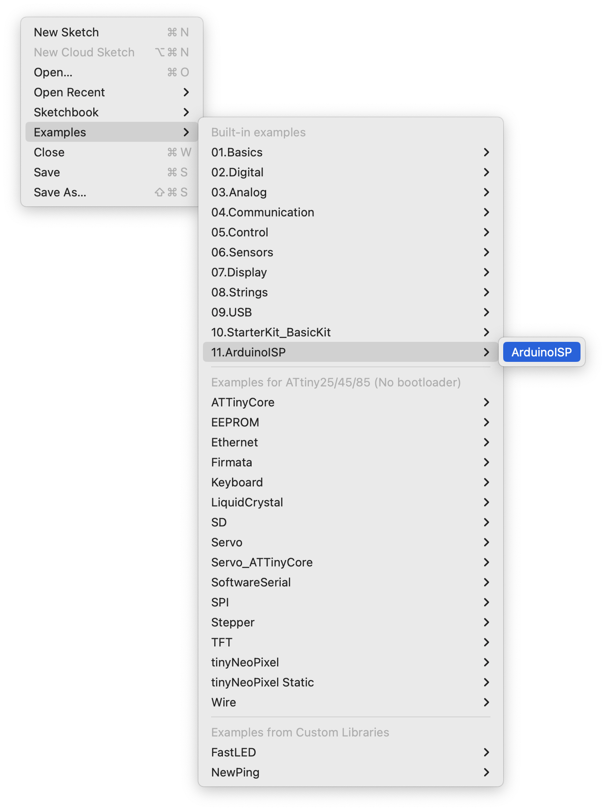
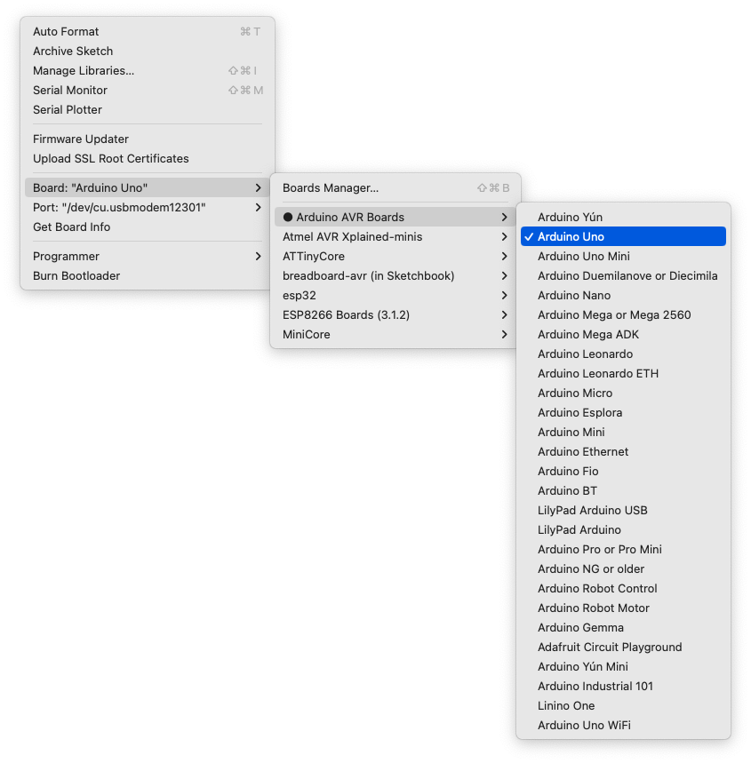
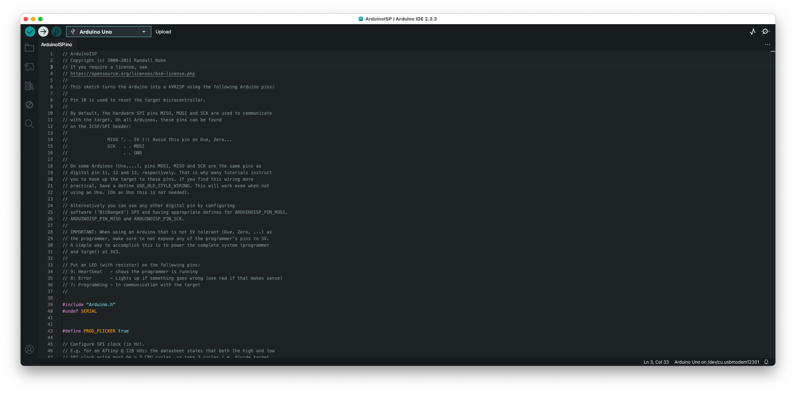
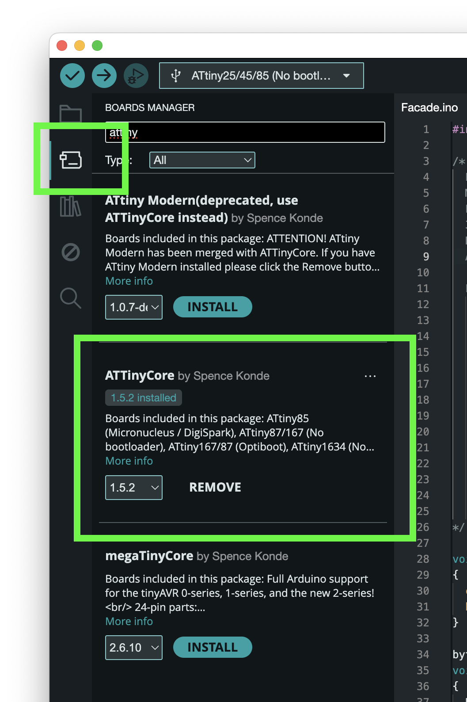
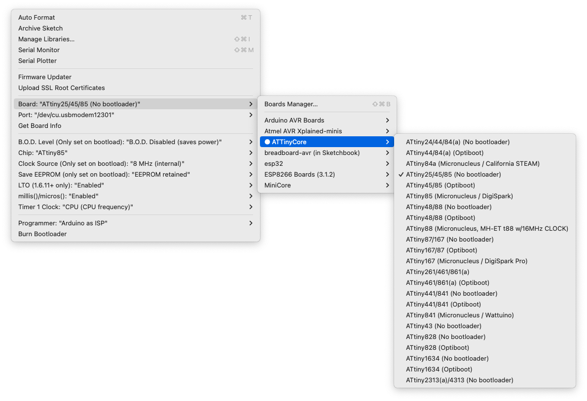
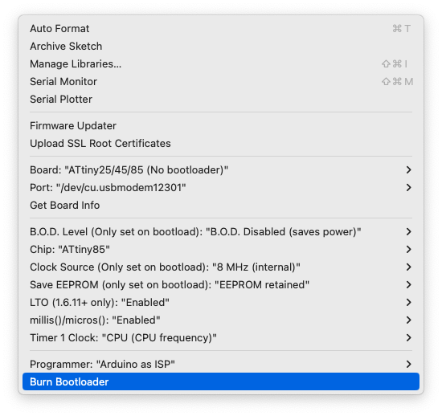
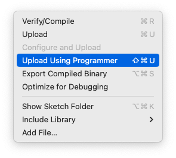

# Setup

## Setup Arduino as ISP

`Files > Examples > 11.ArduinoISP > ArduinoISP`

## Setup Programming Circuit

## Install Library & Select Board

`Board Manager > Install ATTinyCore`

`Tools > Board > ATTinyCore > ATTiny25/45/85 (No bootloader)`

## Burn Bootloader on ATTiny85

This step is important. If you don't do this, you can end up with odd functionality.

`Tools > Burn Bootloader` with the following settings:

## Setup Programming Circuit

## Upload Software to ATTiny85

Now that the ATTiny85 is in the programming circuit and the Arduino has the `ArduinoISP` sketch uploaded, we're ready to upload software to it.

`Sketch > Upload Using Programmer`

# Gotchas

- Be careful when loading large variables into memory at runtime. It can cause a stack/heap? overflow which can crash the program. This can be very hard to debug, since you don't get any error messages. The program will usually just stop functioning or have very odd behavior.
  - Instead, use `PROGMEM` for large variables / lookup tables.
- Writing to `Serial` can cause problem on certain pins. Remove all logging and serial communication setup before trying debugging other methods. Otherwise, this can cause a huge time sink.

# Memory

- Flash: Persistant (stores executable sketch, limited writes ~10,000) (8KB)
- RAM/SRAM: Variables, stack, etc (512 Bytes)
- EEPROM: Persistance storage (limited writes ~10,000) (512 Bytes)
  - Be careful writing to this too often, as it can eventually fail

# Reference

- https://homemadehardware.com/guides/programming-an-attiny85/

# Todo

- [x] Decide on Gradients
- [x] Decide on Solids
- [x] Fade between colors for transition
- [x] Update PCB buttons to be vertical
